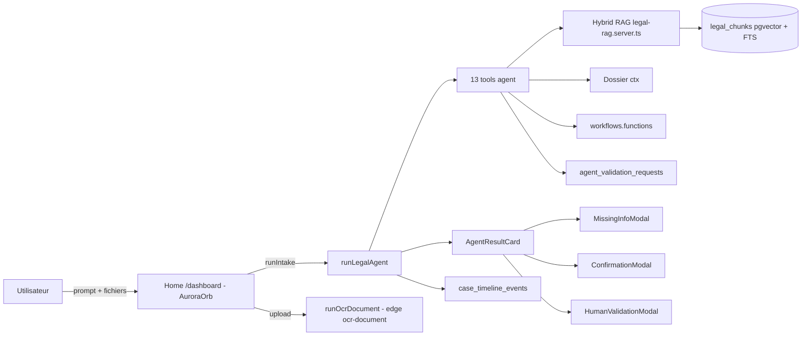
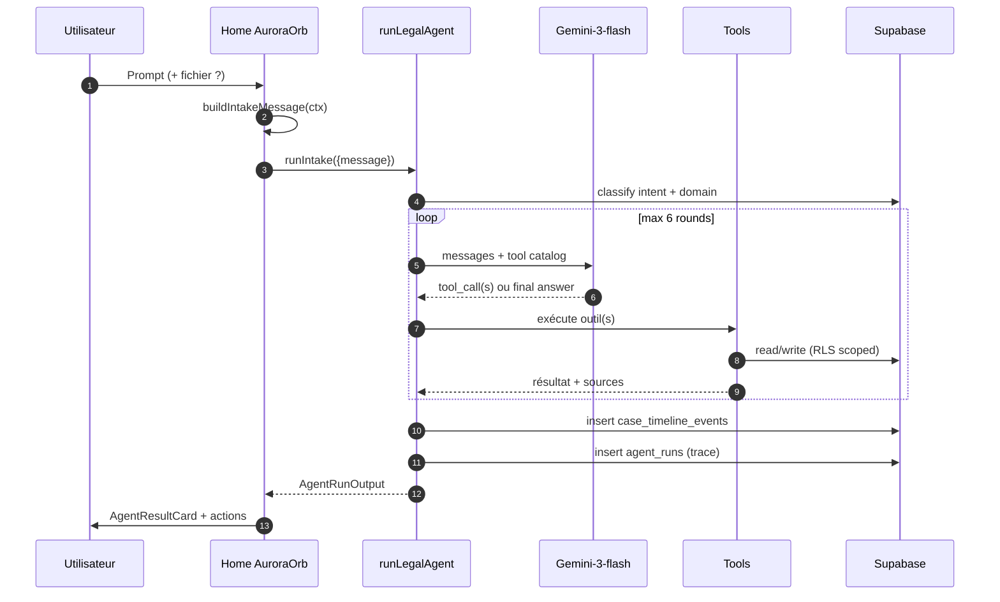
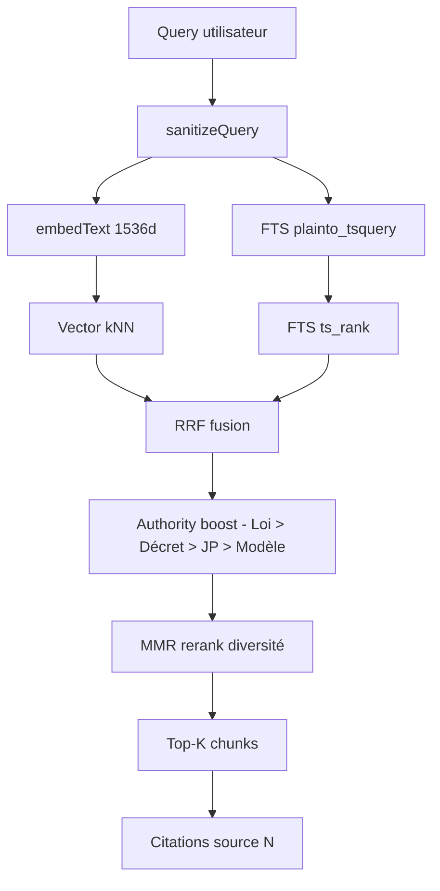
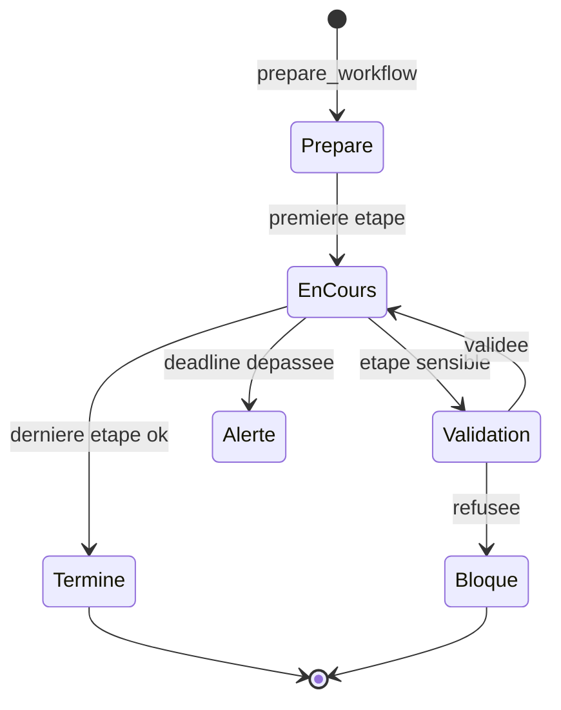
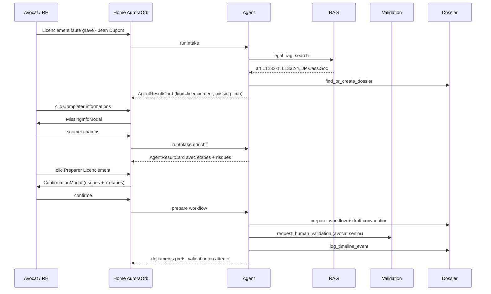

# 🧭 Audit complet JurisAI

> Document de référence — architecture, agent, RAG, workflows, parcours client.
> Version : mai 2026 — état du code après Lots A → E.

---

## 1. Vision produit

JurisAI **n'est pas un outil RH**. C'est un **assistant juridique transverse** qui couvre :
RH / social, commercial, sociétés, RGPD, fiscalité simple, réglementation métier,
contrats, contentieux, administratif.

Logique fondamentale appliquée partout :

> **Comprendre → Sourcer → Proposer → Préparer → Valider → Exécuter → Archiver → Suivre → Alerter**

Chaque action significative est :
- rattachée à un **dossier** (case),
- tracée dans `case_timeline_events` via `logTimelineEvent`,
- soumise aux règles **multi-tenant** (`getTenantId(userId)` + RLS `is_member_of_tenant`),
- sourcée juridiquement (citations `[source:N]`) si elle touche au droit.

---

## 2. Architecture technique générale

### Stack
- **Frontend / SSR** : TanStack Start v1 + React 19 + Vite 7, déployé Cloudflare Workers.
- **Style** : Tailwind v4, tokens sémantiques OKLCH dans `src/styles.css`.
- **Backend métier** : `createServerFn` (RPC typé) dans `src/server/*.functions.ts`.
- **DB** : Supabase Postgres + RLS + pgvector + FTS.
- **Edge Functions Supabase** : réservées à l'**ingestion juridique** (Légifrance, Judilibre, KALI, CDTN, OCR, watch-cron).
- **AI Gateway Lovable** :
  - LLM : `google/gemini-3-flash` (agent).
  - Embeddings : `openai/text-embedding-3-small` (1536 dims).

### Principes structurants
| Principe | Implémentation |
|---|---|
| Multi-tenant strict | `src/server/_shared/tenant.server.ts` + RLS `is_member_of_tenant` |
| Timeline systématique | `src/server/_shared/timeline.server.ts → logTimelineEvent` |
| Sécurité fonctions | `SECURITY DEFINER` + `REVOKE EXECUTE FROM PUBLIC; GRANT EXECUTE TO service_role` |
| RAG sourcé | `legal_chunks` hybride vecteur+FTS, refus si source insuffisante |
| Validations humaines | `agent_validation_requests` + modales métier |

### Schéma macro



---

## 3. Architecture de l'Agent

### 3.1 Fichiers clés
- `src/server/agent.functions.ts` — orchestrateur (`runLegalAgent`).
- `src/server/_shared/agent-tools.server.ts` — définition des 13 outils.
- `src/server/_shared/legal-rag.server.ts` — RAG hybride.
- `src/server/agent-validations.functions.ts` — création/lecture demandes de validation.
- `src/lib/agent/business-rules.ts` — règles métier client (kind, risques, étapes).
- `src/lib/agent/home-intake.ts` — enrichissement du message côté client.
- `src/components/agent/AgentResultCard.tsx` + 3 modales (`MissingInfo`, `Confirmation`, `HumanValidation`).

### 3.2 Boucle agent



### 3.3 Catalogue des 13 outils

| # | Outil | Rôle | Sensible |
|---|---|---|---|
| 1 | `legal_rag_search` | Recherche hybride dans corpus juridique | non |
| 2 | `get_dossier_context` | Snapshot d'un dossier + timeline | non |
| 3 | `list_user_dossiers` | Lister dossiers du tenant | non |
| 4 | `find_or_create_dossier` | Création dossier (rattachement) | oui |
| 5 | `attach_document_to_dossier` | Lier document↔dossier | oui |
| 6 | `extract_entities` | NER (parties, dates, montants) | non |
| 7 | `prepare_workflow` | Préparer instance workflow | non |
| 8 | `run_workflow_step` | Exécuter étape workflow | oui |
| 9 | `schedule_reminder` | Rappel/échéance | oui |
| 10 | `draft_document` | Génération document depuis template | oui |
| 11 | `request_human_validation` | Crée `agent_validation_request` | oui |
| 12 | `log_timeline_event` | Trace dossier explicite | non |
| 13 | `notify_user` | Notification interne | oui |

> Tout outil **sensible** déclenche au minimum une trace + (selon cas) une demande de validation humaine.

### 3.4 Sortie `AgentRunOutput`
```ts
{
  run_id, intent, domain, topic,
  answer, refused, refusal_reason,
  requires_validation,
  missing_information: string[],
  suggested_actions: { label, payload? }[],
  sources: { n, title, ref?, url? }[],
  trace: { tool, succeeded, sensitive, validation_request_id? }[],
}
```

---

## 4. RAG juridique

### 4.1 Pipeline ingestion (Edge Functions)
- `connector-legifrance`, `connector-judilibre`, `connector-kali`, `connector-cdtn-modeles`
- `ingest-legal-source` : nettoyage, smart-chunk, embedding, upsert `legal_sources` / `legal_chunks`.
- `legal-watch-cron` : veille périodique + diff + notifications.
- Outils partagés : `_shared/piste.ts`, `smart-chunk.ts`, `embeddings.ts`, `rag.ts` (sanitize, MMR, log).

### 4.2 Recherche hybride



Formule simplifiée :
```sql
score = (1.0/(60+vector_rank) + 1.0/(60+fts_rank)) * authority_boost
```

### 4.3 Garde-fous
- Refus motivé si **score < seuil** ou **0 source pertinente**.
- Filtres `idcc` (convention collective) selon abonnement tenant.
- Anti prompt-injection (`sanitizeQuery`).
- Validation citations (`citation-validator`).

### 4.4 État du corpus
- ~26 sources en base actuellement (seed + tests).
- **Bloquant** : credentials PISTE (Légifrance/Judilibre) à activer pour ingestion massive.

---

## 5. Workflows / procédures

### 5.1 Modèle
- `workflows` : 46 procédures cataloguées (RH, Commercial, Sociétés, RGPD…).
- `workflow_steps` : étapes typées (info, document, validation, délai légal).
- `workflow_instances` : exécution dans un dossier.
- `workflow_step_runs` : état par étape + résultat + sources.

### 5.2 Cycle d'exécution



### 5.3 UI
- `/workflows` : catalogue groupé par domaine (Lot D), badges count.
- `/workflows/$id` : détail procédure + lancement sur un dossier.
- Étapes documentent leur source juridique (lien `legal_chunks`).

---

## 6. Pipeline document & home

### 6.1 Upload depuis Home
1. `processFile()` → upload Supabase Storage `dossier-files/{tenant}/{uuid}`.
2. `runOcrDocument` (edge) → texte + métadonnées.
3. Auto-link dossier : `entity-extraction.server.ts` + `context-link.server.ts` (similarité sémantique).
4. `DocumentResultCard` affiche aperçu OCR + actions (résumé, risques, agent).
5. Si prompt joint : `buildIntakeMessage` → `runIntake` avec contexte injecté.

### 6.2 Page document `/analyses/$id`
- Texte + entités + risques contractuels (`contract-risks.ts`).
- CTA "Demander à l'agent" → deep-link `/dashboard?q=...` (Lot D).
- Historique d'analyses + versions.

---

## 7. Home page (Dashboard)

### 7.1 Composants
- `AuroraHero` + `AuroraOrb` + `HeroPromptInput` (input multimodal).
- `SuggestionChip` : actions contextuelles selon profil.
- `AgentResultCard` (rendu inline du résultat agent).
- `DocumentResultCard` (rendu inline du résultat OCR).

### 7.2 Comportements clés
- Auto-trigger via `?q=...` (deep-link depuis n'importe quelle page).
- Upload + prompt simultanés → agent reçoit le contexte OCR.
- Pas de page `/agent` séparée : la home **EST** l'agent.

---

## 8. Modales métier (règles `pickRule`)

| Modale | Déclencheur | Contenu |
|---|---|---|
| **MissingInfoModal** | `missing_information.length > 0` ou `required_fields` de la règle | Champs structurés + questions libres |
| **ConfirmationModal** | `rule.steps.length > 0` | Risques juridiques + étapes prévues |
| **HumanValidationModal** | `requires_validation` ou `rule.kind !== "generic"` | Choix rôles destinataires + SLA |

Les règles vivent dans `src/lib/agent/business-rules.ts` :
exemples de `kind` = `licenciement`, `rupture_conventionnelle`, `cdd_renouvellement`,
`contrat_commercial_sensible`, `traitement_donnees_sensibles`, etc.

---

## 9. Parcours client (end-to-end)

### 9.1 Cas type : "Je veux licencier un salarié pour faute"



### 9.2 Étapes génériques

1. **Comprendre** — classification intent/domain/topic.
2. **Sourcer** — RAG hybride + citations.
3. **Proposer** — réponse + `suggested_actions`.
4. **Préparer** — workflow + drafts + entités extraites.
5. **Valider** — modales (missing / confirm / human).
6. **Exécuter** — `run_workflow_step` (sans envoi externe sans validation).
7. **Archiver** — documents + versions + liens dossier.
8. **Suivre** — `case_timeline_events` + dashboard dossier.
9. **Alerter** — `schedule_reminder` + notifications + veille (`legal-watch-cron`).

---

## 10. Sécurité & conformité

- RLS sur **toutes** les tables métier (jamais de bypass côté client).
- `getTenantId(userId)` obligatoire avant toute requête métier.
- Fonctions `SECURITY DEFINER` : `REVOKE PUBLIC` + `GRANT service_role`.
- Audit complet : `agent_runs`, `case_timeline_events`, `audit_log`.
- Refus IA si pas de source fiable → pas d'hallucination juridique.
- Validation humaine obligatoire pour toute action sensible (envoi, signature, licenciement…).
- Anti prompt-injection sur la query avant embedding.

---

## 11. État actuel & priorités

### ✅ Fait
- Architecture multi-tenant + RLS.
- Agent canonique 13 tools + 3 modales métier.
- RAG hybride + MMR + authority boost.
- Pipeline OCR + auto-link dossier.
- Home unifiée (suppression `/agent`).
- Catalogue workflows groupé.
- Deep-link agent via `?q=`.

### 🟡 En cours
- Enrichissement business rules (couvrir tous les `kind` produit).
- UI inbox de validations.

### 🔴 Bloqueurs / priorités
1. **Corpus** : credentials PISTE → ingestion Légifrance/Judilibre/KALI à pleine échelle.
2. **Performance RAG** : index HNSW sur `legal_chunks.embedding`.
3. **UX agent** : streaming SSE pour la réponse Gemini.
4. **Veille** : activation `legal-watch-cron` en prod + notifications ciblées par abonnement IDCC.
5. **Observabilité** : dashboards `admin.rag-quality` / `admin.server-errors` à finaliser.

---

## 12. Index fichiers de référence

| Domaine | Fichiers |
|---|---|
| Agent | `src/server/agent.functions.ts`, `_shared/agent-tools.server.ts` |
| RAG | `_shared/legal-rag.server.ts`, `supabase/functions/_shared/rag.ts` |
| Tenant/Timeline | `_shared/tenant.server.ts`, `_shared/timeline.server.ts` |
| Documents | `_shared/document-pipeline.server.ts`, `_shared/entity-extraction.server.ts`, `_shared/context-link.server.ts` |
| Workflows | `src/server/workflows.functions.ts`, `workflow-validation.functions.ts` |
| Home | `src/routes/_authenticated/dashboard.tsx`, `src/components/aurora/*`, `src/components/agent/*` |
| Règles client | `src/lib/agent/business-rules.ts`, `home-intake.ts` |
| Ingestion | `supabase/functions/connector-*`, `ingest-legal-source`, `legal-watch-cron`, `ocr-document` |

---

*Document généré dans le cadre de l'audit produit — à maintenir au fil des évolutions.*
