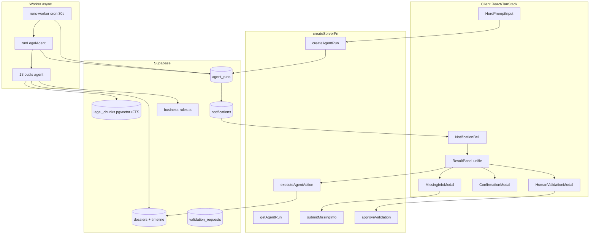
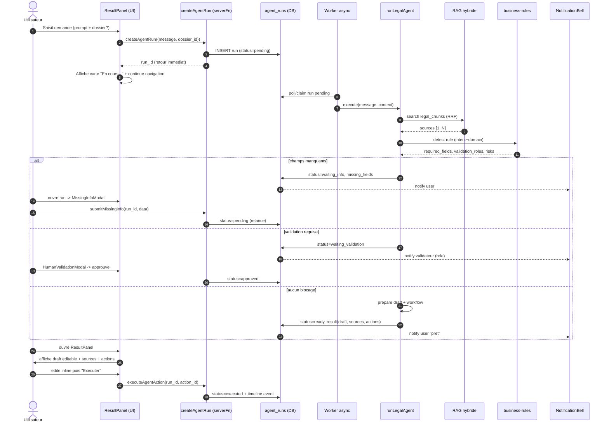
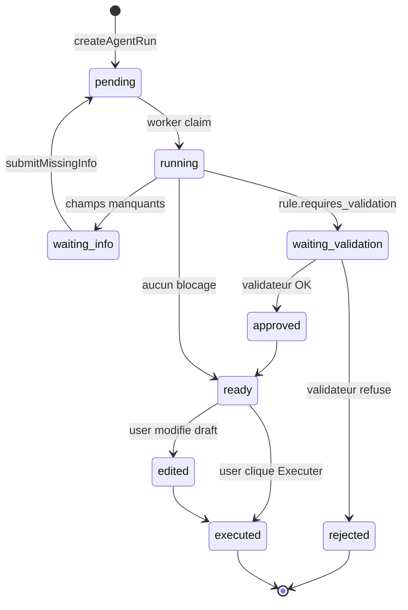

# JurisAI — Logique Agent Async & Plan d'implémentation

> Document de référence : comment passe-t-on de l'agent synchrone actuel à un
> agent **stateful, asynchrone, notifié, éditable** — fidèle à la logique
> *Comprendre → Sourcer → Demander → Valider → Exécuter → Archiver*.

---

## 1. Principe en 1 phrase

L'utilisateur **lance une demande → repart vaquer à autre chose** → l'agent
travaille en background → l'utilisateur est **notifié** quand il faut intervenir
(info manquante / validation) ou quand le résultat est prêt → il **édite et
exécute** depuis un seul écran (`ResultPanel`).

---

## 2. Architecture cible

---

## 3. Parcours complet d'une demande

---

## 4. Machine à états du `agent_run`

---

## 5. Ce qui change vs aujourd'hui

| Aspect | Aujourd'hui | Cible |
|---|---|---|
| Exécution | Synchrone (l'utilisateur attend devant l'écran) | **Async** : run persisté, worker traite, user notifié |
| État | Volatile (perdu si onglet fermé) | Table `agent_runs` (status, draft, sources, missing_fields) |
| Validation | Modale qui bloque le flux | Notification → l'utilisateur ouvre quand il veut |
| Résultat | Card lecture + autre écran pour éditer | **ResultPanel unique** : draft éditable inline + sources + actions |
| Reprise | Impossible | Reprise depuis NotificationBell ou liste "Mes demandes" |
| Friction validation | Toujours | Uniquement si `business-rules` l'exige |

---

## 6. Plan d'implémentation séquencé

### Étape 1 — Persistance des runs (fondation)
**But** : tout run est sauvegardé → permet l'async + la reprise.

- Migration : table `agent_runs`
  - `id, tenant_id, user_id, dossier_id, status, input, draft, sources jsonb,
    missing_fields jsonb, rule_kind, requires_validation, error,
    created_at, updated_at`
- Migration : enum `agent_run_status`
  (`pending|running|waiting_info|waiting_validation|approved|rejected|ready|executed|failed`)
- RLS : `is_member_of_tenant(tenant_id)` + `user_id = auth.uid()`
- Server functions : `createAgentRun`, `getAgentRun(run_id)`, `listMyAgentRuns`

### Étape 2 — Refactor `runLegalAgent` en mode stateful
**But** : l'agent lit/écrit dans `agent_runs` au lieu de retourner un blob.

- Découper en `executeAgentRun(run_id)` : charge le run, exécute la boucle,
  persiste à chaque transition d'état
- À la fin de chaque tour : update `status` + `draft` + `sources`
- Si `business-rules.required_fields` manquants → `status=waiting_info` + stop
- Si `rule.requires_validation` → `status=waiting_validation` +
  `validation_requests`
- Sinon → `status=ready`

### Étape 3 — Worker async
**But** : décorréler exécution de la requête HTTP utilisateur.

- Server route `/api/public/runs-worker` (cron 30s, signé HMAC)
- Claim atomique :
  `UPDATE agent_runs SET status='running' WHERE status='pending' RETURNING id`
  (limit 5)
- Pour chaque run claimé → `executeAgentRun(run_id)`
- pg_cron ou cron externe sur l'URL stable du projet

### Étape 4 — ResultPanel unifié (UI)
**But** : un seul écran qui montre tout, édite tout, déclenche tout.

- Composant `ResultPanel` qui lit un `agent_run` par id (polling 3s tant que
  pas `ready`)
- Affichage selon `status` :
  - `pending|running` → skeleton + indicateur de progression
  - `waiting_info` → bouton qui ouvre `MissingInfoModal` (existant)
  - `waiting_validation` → bandeau + lien vers `HumanValidationModal`
  - `ready` → **draft éditable inline** + sources cliquables + `actions[]`
    (boutons "Générer doc", "Ouvrir wizard", "Archiver")
  - `executed` → lecture seule + lien dossier
- Remplacer l'usage de `AgentResultCard` partout par `ResultPanel`

### Étape 5 — Notifications + Bell
**But** : prévenir sans obliger à attendre.

- Trigger DB sur `agent_runs` : transition vers
  `waiting_info|waiting_validation|ready` → `INSERT notifications`
- `NotificationBell` (existant) : kind `agent_run_*` avec lien `/runs/:id`
- Nouvelle route `/runs/$id` rendant `<ResultPanel runId={id} />`
- Page `/runs` (liste "Mes demandes en cours")

### Étape 6 — Action d'exécution finale + timeline
**But** : transformer le draft validé en acte réel.

- Server fn `executeAgentAction({ run_id, action_id, edited_draft? })`
- Selon `action.kind` : appel `generation.functions`, `workflows.functions`, etc.
- `logTimelineEvent` systématique (`agent.executed`)
- `agent_runs.status = 'executed'`

---

## 7. Bonus optionnels (post-MVP)

- **SSE streaming** sur `executeAgentRun` → progression token par token
- **Replay** : bouton "Relancer avec mêmes inputs"
- **Versioning** : `agent_run_drafts` pour l'historique des éditions

---

## 8. Pourquoi cet ordre ?

Chaque étape est **livrable seule** et débloque la suivante :

1. **Persistance** → on peut tout reprendre
2. **Stateful agent** → la logique métier existe déjà, on la branche sur la table
3. **Worker** → ça devient async (gros gain UX)
4. **UI unifiée** → l'utilisateur voit le bénéfice
5. **Notifications** → boucle fermée
6. **Exécution** → valeur métier finale

---

## 9. Invariants à respecter (rappel mémoire projet)

- `getTenantId(userId)` sur **toute** server function métier
- `logTimelineEvent` à **chaque** transition significative d'un run lié à un dossier
- RAG : citations `[source:N]` obligatoires depuis `legal_chunks`
- Toute fonction `SECURITY DEFINER` :
  `REVOKE EXECUTE FROM PUBLIC; GRANT EXECUTE TO service_role`
- Pas d'edge function pour le métier app — uniquement `createServerFn`
